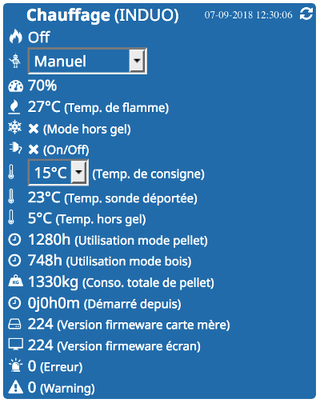
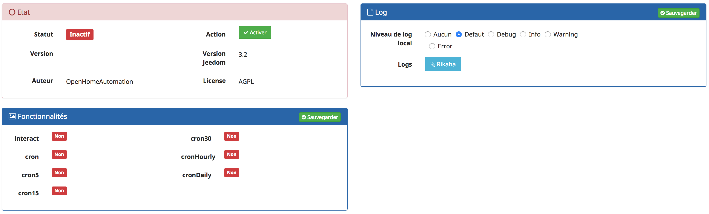
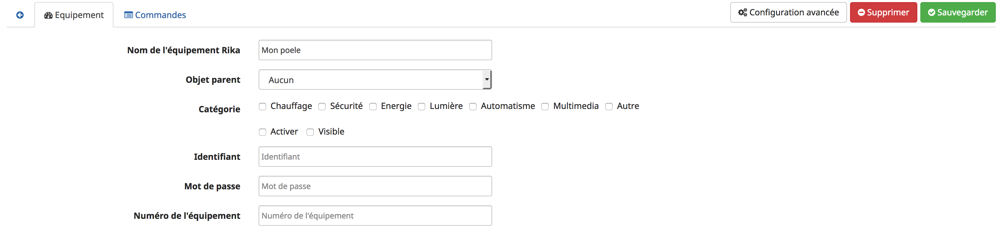

Présentation
============

**Le plugin Rikaha** interface les poêles de la marque Autrichienne Rika avec Jeedom.

Les principales fonctionnalités de Rikaha sont :

**Le monitoring**
> De nombreuses informations sont accessibles et permettent le monitoring de votre poêle dans votre Jeedom.

Ex: La puissance de chauffre, la température de consigne, la température de flamme, la température de la sonde externe, la consommation de pellets ...

**Le pilotage**
> Vous pouvez depuis votre Jeedom piloter des fonctionnalités du poêle.  
Vous pouvez modifier :  
* la température de consigne
* le mode de fonctionnement (Manuel, Automatique, Confort)
* l'état (On/Off)
* l'état Convection MultiAir 1 et 2
* l'étendue de convection MultiAir 1 et 2  
* le degré de convection MultiAir 1 et 2

**Le widget Rikaha**

> Toutes les commandes peuvent désormais être affichées sur le widget, pas uniquement celles pré-sélectionnées.
Pour cela, il faut utiliser la case à cocher "Afficher" présente sur la liste des Commandes

> Le champ "ordre d'affichage" sur la liste des Commandes
Il permet de gérer l'ordre d'affichage des commandes sur le widget.

> Le bouton "Icone" sur la liste des Commandes
Il permet d'afficher la commande avec l'icone sélectionnée sur le widget.

**Informations**

_Il est nécessaire que le poêle soit equipé du système Firenet._

Le développement du plugin est basé sur le modèle Induo

Le plugin Rikaha a été testé sur les modèles :
1. Induo
2. Revo
3. Sumo
4. Domo

Vous pouvez me contacter afin d'ajouter d'autres modèles à la liste

**Activation**

Une seule action, vous devez cliquer sur _Activer_.
Le plugin est croné toute les 30 mn.

**Création de votre équipement**

Après avoir nommé l'équipement saisissez :

 1. L'identifiant de votre compte Firenet dans le champ Identifiant
 2. Le mot de passe de votre compte Firenet dans le champ Mot de passe
 3. Le numero identifiant votre poêle dans le champ Numéro de l'équipement  
 Ce numero est présent dans l'url lorsque vous êtes conecté sur le site firenet.  
 Ex : `https://www.rika-firenet.com/web/stove/xxxxxxxx`  
 "xxxxxxxx" est la valeur à renseigner dans le champ Numéro de l'équipement  
 4. la Capacité du réservoir (Kg).  
Permet de gérer des alertes en fonction du niveau de pellet restant. Saisissez 0 pour désactiver cette fonctionnalité  
 5. Template du widget  
Les templates pré-sélectionnent des commandes qui seront affichées sur le widget. Sur cette version 3 templates sont disponibles : standard, domo, induo

N'oubliez pas de sauvegarder !

Félicitation, vous avez terminé la configuration.

Vous pouvez actualiser manuellement les informations en cliquant sur l'icone située en haut à droite du widget.
